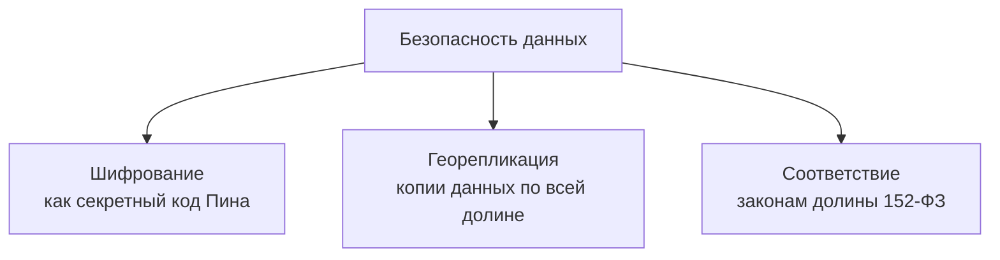

## ☁️ Облачные подходы и онлайн-инструменты для работы с базами данных

### Введение

Пин запутался в чертежах своих изобретений. Совунья не могла учесть все банки с вареньем. А Бараш терял свои бесценные стихотворные рукописи. Каждый Смешарик столкнулся с одной проблемой: их личные «данные» перестали помещаться и стали создавать хаос.

> *Решением стало использование **облачных технологий**, которые предлагают масштабируемое, надежное и экономичное хранение информации.*

### Модели облачных услуг

**IaaS** - для Пина, который любит всё контролировать. Ему дают "голые" серверы и сети — как будто готовый гараж с инструментами, где он может собирать свои изобретения с нуля.

**PaaS** - для Лосяша, который хочет творить, не отвлекаясь на рутину. Ему предоставляют готовую лабораторию с пробирками и микроскопами — остаётся только ставить эксперименты.

**SaaS** - для Нюши, которая просто хочет красоты. Готовое приложение, как салон красоты "под ключ" — пришла и пользуешься.

### Облачные базы данных

| Тип базы данных | Для кого | Как работает | Примеры |
|-----------------|----------|--------------|---------|
| **DBaaS** | Совунья | Cкладывает свои банки с вареньем в "умный амбар", а он автоматически охраняется, убирается и расширяется.  | Yandex Cloud Managed Service for PostgreSQL  |
| **Бессерверные БД** | Крош | Эффективны для работы с переменными нагрузками. Оплата только за фактическое использование ресурсов. | Yandex Cloud Serverless Databases  |

### Инструменты управления

**Веб-консоли** - как "пульт управления" для Лосяша: смотрит в экран и видит всё что происходит с данными.

**Миграция данных** - помогает аккуратно перевезти все архивы Бараша (его стихи и философские труды) из старого комода в новый облачный амбар.

**BI-платформы** - "волшебные очки" для Ёжика: надеваешь и видишь не просто цифры, а красивые графики и закономерности.

### Безопасность и надежность

### Заключение
Результат внедрения облачных технологий:

| До ❌ | После ✅ |
|----|-------|
| 📚 Бумажные тетрадки | 🗂️ Централизованное хранилище |
| ❓ Потерянные данные | 🔒 Надежное резервное копирование |
| ⚙️ Ручное управление | 🤖 Автоматическое масштабирование |

> ***Облачные базы данных** — это команда помощников для каждого Смешарика, позволяющая сосредоточиться на любимом деле, а не на проблемах с хранением!*