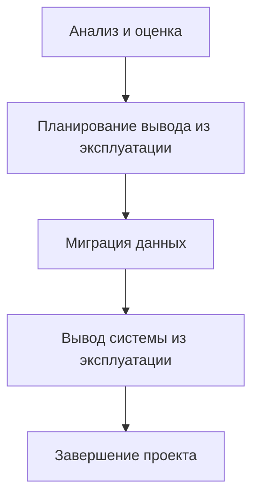

# 🚫 Завершение жизненного цикла и оценка эффективности информационной системы 🚫

**Жизненный цикл информационной системы (ИС)** – это период времени от момента возникновения потребности в системе до её полного вывода из эксплуатации. 

## Причины завершения жизненного цикла ИС

| Причина | Сущность причины |
|---------------|------------------|
| **Технологическое устаревание** | Использование устаревших технологий, которые сложно поддерживать, модернизировать и интегрировать с новыми системами  |
| **Функциональное устаревание** | Несоответствие функциональности системы изменяющимся бизнес-требованиям и новым стратегиям организации |
| **Экономическое устаревание** | Высокие затраты на поддержание и эксплуатацию системы, превышающие экономическую выгоду от ее использования  |
| **Нормативное устаревание** | Несоответствие системы новым нормативным требованиям, стандартам и законодательству |
| **Физическое устаревание** | Износ оборудования, выход из строя компонентов системы, что приводит к снижению надежности и увеличению затрат на ремонт |

## Процесс завершения жизненного цикла ИС

## Оценка эффективности ИС

**Оценка эффективности ИС** – это процесс определения степени достижения целей, поставленных при создании системы.

> Оценка эффективности должна проводиться на протяжении всего жизненного цикла ИС, но особенно важна на этапе завершения, поскольку позволяет оценить вклад системы в достижение бизнес-целей и принять обоснованное решение о ее дальнейшей судьбе.

**Существуют различные методы оценки эффективности ИС, которые можно разделить на следующие группы:**

| Направление | Показатели |
|-------------|------------|
| **Экономическая** | ROI, NPV, IRR, срок окупаемости |
| **Функциональная** | Соответствие требованиям, степень автоматизации, удовлетворенность пользователей |
| **Техническая** | Надежность, производительность, безопасность (время безотказной работы, время отклика) |
| **Организационная** | Влияние на бизнес-процессы, затраты на персонал, качество обслуживания |

**Методы оценки:**

- Анализ затрат и выгод
- Экспертная оценка
- Опросы и анкетирование пользователей
- Сбор метрик производительности
- Сравнение с лучшими практиками

## Утилизация оборудования и архивирование данных

**Утилизация оборудования:**
- Должна проводиться в соответствии с законодательством и экологическими нормами
- Обязательное безопасное уничтожение данных на носителях

**Архивирование данных:**
- Необходимо для соблюдения законодательных требований и возможного будущего доступа
- Данные архивируются в подходящем для долгосрочного хранения формате
- Разрабатываются политики хранения и доступа к архиву

---
**Завершение жизненного цикла ИС** – это сложный и ответственный процесс, который требует тщательного планирования и подготовки. Правильный вывод системы из эксплуатации позволяет минимизировать риски и издержки, связанные с устаревшей системой, и обеспечить плавный переход к новым технологиям. 