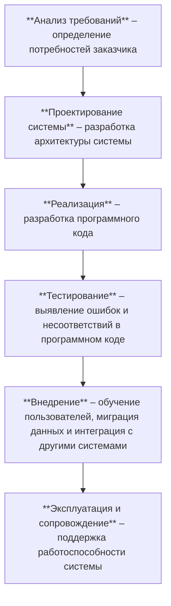

# Жизненный цикл и этапы разработки автоматизированных систем (АС)

**Автоматизированная система** — комплекс программных, технических и информационных средств для автоматизации деятельности в определённой предметной области.

**Жизненный цикл АС** — период времени от момента возникновения потребности в системе до её полного вывода из эксплуатации. 

## Модели жизненного цикла

Выбор модели зависит от специфики проекта, требований, ресурсов и опыта команды.

| Модель | Суть подхода | Плюсы | Минусы |
|--------|--------------|-------|--------|
| **Каскадная** | Строго последовательное выполнение этапов | Простота управления, чёткая структура | Сложность внесения изменений |
| **Инкрементная** | Разработка и внедрение по частям (инкрементам) | Раннее получение результатов, гибкость | Требует тщательной координации |
| **Спиральная** | Итеративная разработка с управлением рисками | Снижение рисков, возможность изменений | Сложность, требует высокой квалификации |
| **Agile** | Короткие циклы, гибкость, взаимодействие с заказчиком | Быстрая обратная связь, ориентация на ценность | Требует вовлечённости заказчика |

## Основные этапы разработки АС

## Инструменты и методы

- **CASE-средства** - инструменты, предназначенные для автоматизации этапов разработки АС (например, AllFusion ERwin Data Modeler, Rational Rose).
- **Системы управления проектами** - инструменты для планирования, организации и контроля выполнения задач в проекте (например, Microsoft Project, Jira).
- **Системы контроля версий** - инструменты для управления изменениями в исходном коде (например, Git, SVN).
- **Инструменты тестирования** - инструменты для автоматизации процессов тестирования, что позволяет сократить время и повысить качество тестирования (например, Selenium, JUnit).
- **Методологии** - наборы принципов, практик и инструментов для организации процесса разработки (Agile, Scrum, Kanban).

---
Жизненный цикл АС представляет собой сложный и многоэтапный процесс, который требует систематического подхода и применения современных методов и инструментов разработки.
