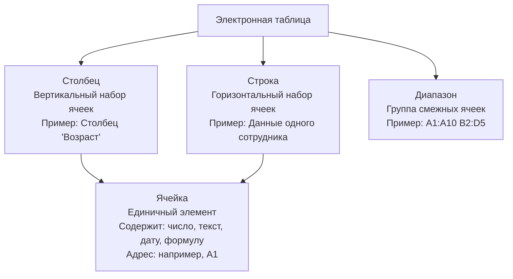

# Структура и организация табличных данных в электронных таблицах

>Электронные таблицы – мощный инструмент для хранения, обработки и анализа данных. Применяюся в бизнесе, науке, образовании и других сферах.


## Структура табличных данных


## Организация данных в электронных таблицах

### Логическая структура

Данные структурируются по логике предметной области.

| Элемент | Назначение | Пример |
|---------|-------------|---------|
| **Заголовки столбцов** | Описание признаков | "Имя", "Возраст", "Цена" |
| **Строка (запись)** | Отдельный объект или запись | Информация об одной продаже (дата, товар, количество, цена) |


### Обеспечение целостности и правильности данных
| Метод | Цель | Пример |
|-------|-------|---------|
| **Валидация данных** | Ограничение ввода (числа, даты, списки) | В столбце "Возраст" только числа 18-65 |
| **Защита ячеек** | Предотвращение случайных изменений | Защита ячеек с формулами, чтобы пользователь не мог случайно удалить или заменить их|
| **Формулы и функции** | Автоматическая обработка | Вычисление общей суммы заказа на основе количества и цены |

### Использование таблиц как базы данных
- Преобразование диапазонов в структурированные таблицы (Excel: "Форматировать как таблицу")
- Автоматические расширения, сортировка, фильтрация, именованные диапазоны
- *Пример*: при добавлении новой строки в таблицу, отформатированную как таблица, форматирование автоматически применяется к новой строке

## Основные принципы организации таблиц
- **Ясность и однозначность**: структура понятна любому
- **Однородность данных**: в столбце – один тип признака
- **Минимизация избыточности**: избегать повторов
- **Формулы и автоматизация**: сокращение ручной работы, повышение точности

## Особенности организации данных в популярных электронных таблицах

| Программа | Особенности | Пример применения |
|-----------|-------------|-------------------|
| **Microsoft Excel** | Богатый набор инструментов, сводные таблицы, функции проверки данных | Использование сводных таблиц для анализа продаж по регионам |
| **Google Таблицы** | Совместная работа, автоматическая синхронизация, встроенные скрипты | Создание скрипта для автоматической отправки уведомлений при достижении уровня запасов |
| **LibreOffice Calc** | Открытое ПО с широкими возможностями | Бесплатная альтернатива с совместимостью с основными форматами |


>Структура и организация данных – ключевой фактор эффективности
Правильное построение: точность анализа, автоматизация, удобство
Современные инструменты: сложные модели, автоматизированные системы
```
