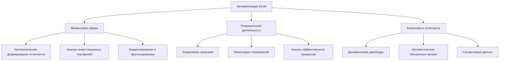

# Автоматизация рабочих процессов в Microsoft Excel

## Введение 💩:

Автоматизация в Microsoft Excel — это современный подход к оптимизации рабочих процессов, который позволяет трансформировать рутинные операции в эффективные автоматизированные решения. Данная технология перемещает фокус с ручного ввода данных на создание интеллектуальных систем, значительно повышающих производительность, точность и аналитические возможности работы с информацией.

## Основные инструменты автоматизации

### Формулы и функции

Базовый инструмент для автоматизации вычислений, включающий:

- Стандартные функции (ВПР, СУММЕСЛИ, ЕСЛИ) для повседневных расчетов
- Динамические массивы для сложных операций с данными
- Логические функции для автоматического принятия решений
- Комбинированные формулы для многоуровневых вычислений

### Power Query

Мощный инструмент для работы с данными:

- Автоматический сбор информации из múltiples источников
- Очистка и преобразование данных по заданным алгоритмам
- Создание повторяемых процессов обработки
- Интеграция с внешними базами данных и системами

### Макросы и VBA

Решение для сложной автоматизации:

- Запись последовательностей действий
- Создание пользовательских функций
- Разработка специализированных интерфейсов
- Автоматизация взаимодействия с другими приложениями

## Методология внедрения автоматизации

### 1. Анализ процессов

Выявление задач с максимальным потенциалом автоматизации:

- Составление перечня повторяющихся операций
- Определение временных затрат на рутинные задачи
- Оценка рисков человеческих ошибок
- Приоритезация задач по критериям эффективности

### 2. Разработка решения

Подбор оптимальных инструментов для каждой задачи:

- Выбор между формулами, Power Query и макросами
- Создание прототипа на тестовых данных
- Разработка пользовательского интерфейса
- Интеграция с существующими процессами

### 3. Тестирование и валидация

Обеспечение надежности автоматизированной системы:

- Проверка на корректных данных и граничных условиях
- Тестирование реакции на ошибки ввода
- Сравнение с результатами ручных расчетов
- Внедрение механизмов обработки ошибок

### 4. Обучение пользователей

Эффективное внедрение автоматизированных решений:

- Создание понятных инструкций и руководств
- Проведение практических тренировок
- Организация технической поддержки
- Сбор обратной связи для улучшения системы

## Практическое применение

## Заключение
С помощью функций Excel можно создавать динамические рабочие листы, позволяющие получать точные результаты за считанные секунды. Кроме того, можно безопасно экспериментировать с другими значениями, не влияя на состояние исходного рабочего листа. После создания рабочего листа можно переходить к следующему этапу: форматированию, построению диаграмм и печати документа.
