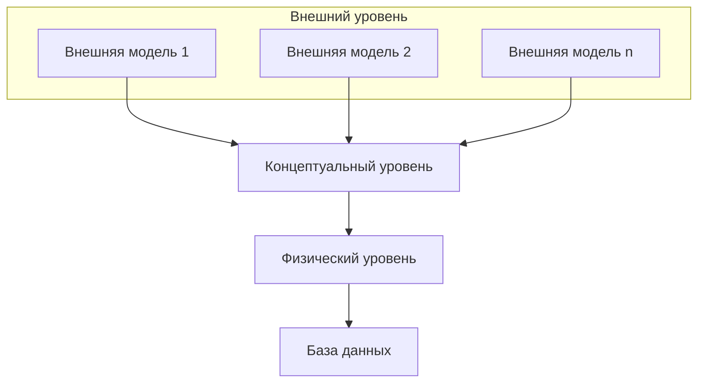

# Понятие, функции и структура СУБД

**Система управления базами данных (СУБД)** – это совокупность языковых и программных средств, предназначенных для создания, ведения и совместного использования БД многими пользователями. СУБД обрабатывает поступающие запросы от пользователей и прикладных программ к БД, а затем выдает необходимые им сведения.

Основное назначение СУБД – быть связующим звеном между пользователем (его запросом или приложением, в котором сформулирован запрос) и базой данных.

В результате СУБД выступает в качестве:
- среды взаимодействия пользователя и базы данных
- инструментальных средств создания и ведения базы данных.

## Функции систем управления базами данных:
- управление данными во внешней памяти;
- управление данными в оперативной памяти;
- управление транзакциями;
- журнализация, резервное копирование и восстановление

### Управление данными во внешней памяти
- **Возможность сохранять, извлекать и обновлять данные** в базе данных
- **Контроль доступа к данным** — возможность обеспечить только санкционированный доступ к базе данных, используя защиту паролем, поддержку уровнен доступа к базе данных и к отдельным ее элементам и т.д.
- **Обеспечение параллельной работы нескольких пользователей**. Управление параллельностью заключается в том, что СУБД имеют механизм блокировок, который гарантирует корректное обновление данных многими пользователями при одновременном доступе. Типы блокировок: табличные, страничные, строчные и др.
- **Поддержка целостности данных** осуществляется инструментальными средствами контроля для того, чтобы данные и их изменения соответствовали заданным правилам.

**Целостность БД** – свойство, означающее, что в БД содержится полная, непротиворечивая и адекватно отражающая предметную область информация.

Целостность описывается с помощью различных ограничений (ограничение диапазона возможных значений атрибутов объектов, отсутствие повторяющихся записей в таблице БД и др.)

### Управление данными в оперативной памяти
- **Буферизация данных в оперативной памяти** – один из основных способов увеличения скорости доступа к данным БД.
- **Буферы** – области оперативной памяти, предназначенные для ускорения обмена между внешней и оперативной памятью.
- В буферах временно хранятся фрагменты БД, которые планируется использовать.

### Управление транзакциями
**Транзакция** — совокупность действий над базой данных, рассматриваемых СУБД как единое целое.

Если транзакция выполняется успешно, СУБД фиксирует изменения БД, произведенные этой транзакцией, во внешней памяти. Если все изменения в рамках транзакции отменяются, ни одно из них никак не отражается на состоянии БД.

Понятие транзакции необходимо для поддержания логической целостности БД.

**Пример**: операция перевода денег с одного счета на другой в банковской системе.

Допустим с одного счета были сняты деньги (т.е. счет уменьшился на n-ю сумму), далее произошел сбой в системе и другой счет не увеличился на эту сумму. В результате происходит откат транзакции, т.е. отмена всех операций (первый счет восстановится).

### Журнализация, резервное копирование, восстановление
Одно из основных требований к СУБД – **надежность хранения данных во внешней памяти**, т.е. возможность ее восстановления.

- **Журнализация изменений** заключается в последовательной записи во внешнюю память всех изменений, выполняемых в базе данных. Записывается следующая информация: порядковый номер, тип и время изменения; идентификатор транзакции; объект, подвергшийся изменению (номер хранимого файла и номер блока данных в нем, помер строки внутри блока); предыдущее состояние объекта и новое состояние объекта.

Журнал является особой частью базы данных, недоступной пользователям СУБД.

- **Резервное копирование базы данных** — процесс создания копии данных на носителе, предназначенном для восстановления данных в оригинальном или новом месте их расположения в случае их повреждения или разрушения.

- **Восстановление базы данных** — функция СУБД, которая в случае логических и физических сбоев приводит базу данных в актуальное состояние.

## Архитектура базы данных. Физическая и логическая независимость данных

В 1978 г. была принята трехуровневая система организации данных, предложенная Национальным Институтом стандартизации – ANSI (American National Standards Institute). В настоящее время данная архитектура СУБД является наиболее распространенной.

### Трехуровневая архитектура СУБД
- **Концептуальный уровень** – отражает обобщенную модель предметной области (объектов реального мира), для которой создается БД (общий взгляд пользователя на данные проектируемой БД).

- **Внешний уровень** – отражает представление конечного пользователя и отдельных приложений о конфигурации данных (например, системе отдела кадров нужны сведения о возрасте, домашнем адресе сотрудника, а системе расчета зарплаты – квалификация работника, стаж).

- **Физический уровень** – отражает описание данных на носителях.

