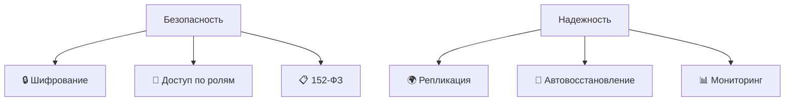

# ☁️ Облачные базы данных и инструменты для работы с ними

>Актуальность облачных решений для работы с базами данных обусловлена ростом объемов информации, потребностью в масштабируемости и экономической эффективностью.

## Ключевые модели услуг

| Модель | Описание | Ответственность потребителя |
|--------|----------|----------------------------|
| **IaaS** (Infrastructure as a Service) | Базовые вычислительные ресурсы (виртуальные машины, системы хранения, сетевая инфраструктура) | Управление ОС, приложениями и данными |
| **PaaS** (Platform as a Service) | Платформа для разработки и выполнения приложений | Разработка приложений и управление данными |
| **SaaS** (Software as a Service) | Готовое ПО как услуга через веб-интерфейс | Использование приложений без управления инфраструктурой |
| **XaaS** (Everything as a Service) | Обобщающая концепция перевода IT-услуг в облачную модель | Зависит от конкретной услуги |

## Классификация облачных моделей БД 

### 1. Database-as-a-Service (DBaaS) 

**Сущность:** Провайдер управляет инфраструктурой БД, вы работаете с данными.

**Преимущества: ✅**
- 📉 Снижение затрат на оборудование
- 📈 Автоматическое масштабирование
- 🗂️ Встроенное резервное копирование
- 🔐 Регулярные обновления безопасности  
- 👥 Профессиональная поддержка

**Примеры:** Yandex Cloud Managed Service for PostgreSQL, SberCloud Базы данных.

### 2. Бессерверные базы данных

**Сущность:** Масштабирование на уровне операций без управления серверами.

**Преимущества: ✅**
- 💰 Экономичность при переменных нагрузках
- 🚀 Масштабирование "от нуля"
- 💵 Оплата только за операции
- 🎯 Простое развертывание

**Примеры:** Yandex Cloud Serverless Databases, российские бессерверные решения.

## Инструменты для работы с облачнымы БД

| Инструмент | Назначение | Преимущества | Примеры |
|------------|------------|--------------|---------|
| **Веб-консоли управления** | Графические интерфейсы для администрирования через браузер | Упрощение администрирования, мониторинг производительности, визуализация метрик | Панели Yandex Cloud и SberCloud |
| **Инструменты миграции данных** | Перенос данных из локальных систем в облако | Минимальное время простоя, автоматическое преобразование форматов, контроль целостности | Отечественные решения с учетом 152-ФЗ |
| **Платформы бизнес-аналитики** | Анализ и визуализация данных | Интерактивная визуализация, SQL-интерфейсы, совместная работа | Yandex DataLens, российские BI-платформы |

## Безопасность и надежность

>Облачные подходы предлагают эффективные решения для управления данными. Отечественные платформы соответствуют высоким стандартам, а их развитие продолжается в сторону автоматизации и расширения функциональности.
